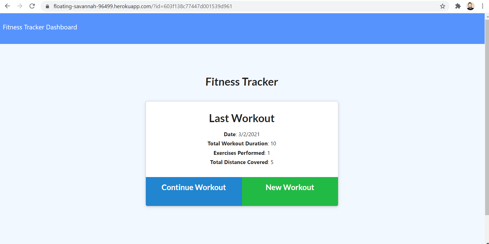
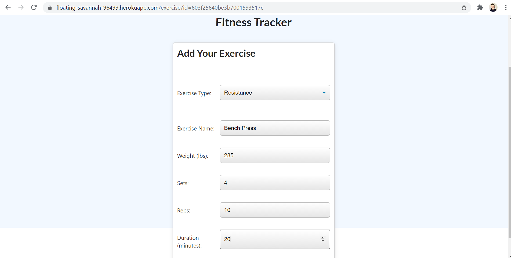

# workout-tracker

## Description

Workout Tracker is an application designed to allow users to keep track of their workouts and the exercised in each workout. As soon as the user navigates to the website, they are presented with the main page. Which shows the user information about the most recent workout, it gives an option to continue the most  recent workout, to add a new workout or to navigate to the Dashboard. Below is a screenshot of the landing page.

The user can click on the Continue Workout button to navigate to a page where an additional exerices can be entered for the current workout. Below is a screenshot of that page.

On this page the user can click Add Exercise to add the new exercise to the workout or complete can also be clicked to complete the workout. If the user clicks on New Workout on the lading page, a new workout is created and the user is presented with the same page listed above but the exercise is added to a new workout document in the database. Below is a screenshot.

Last but not least, the user can navigate to the Dashboard page to see charts about the seven most recent workouts. Below is a screenshot of the page.

## Table of Contents

* [Installation](#installation)
* [Usage](#usage)
* [License](#license)
* [Contributing](#contributing)
* [Tests](#tests)
* [Questions](#questions)

## Installation

If the repository is cloned, simply run npm install in the terminal of your choice to install all the needed npm packages. As an alternative, you can navigate to the deployed application to see the application in action.

https://floating-savannah-96499.herokuapp.com/

## Usage

The application serves users who seek an easy way to keep track of their workouts and exercises in each of their workouts.

## License

[MIT](https://choosealicense.com/licenses/mit/)

## Contributing

Contributions are currently not accepted for this application.

## Tests

There is no testing available within the application.

## Questions

My GitHub username is: chavalk

Link: https://github.com/chavalk

If you have additional questions, feel free to reach me at chavalk@hotmail.com.